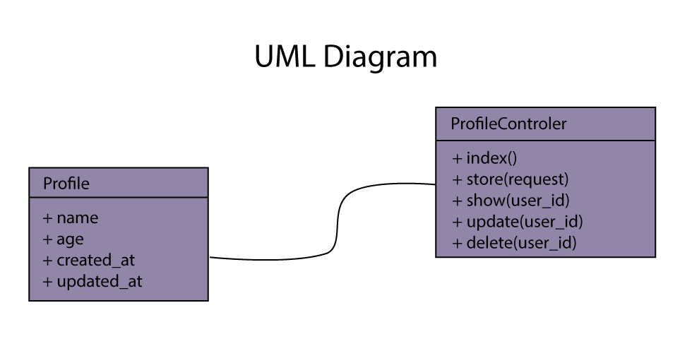

<h2><b>CRUD Operations</b></h2>

this project perform the following operations to the base url (https://chongaichronicles.com)

This endpoint can be tested using Postman with the following settings, base url should be https://chongaichronicles.com

<table>
<thead>
<tr>
<th>Verb</th>
<th>Endpoint</th>
<th>Params</th>
<th>Description</th>
</tr>
</thead>
<tbody>
<tr>
<td>GET</td>
<td>/api</td>
<td>null</td>
<td>This get all the persons in the database table</td>
</tr>
<tr>
<td>GET</td>
<td>/api/:user_id</td>
<td>null</td>
<td>This get a single person from the database table, the</td>
</tr>
<tr>
<td>POST</td>
<td>/api</td>
<td>{name: string; age:string</td>
<td>this create a new person in the database</td>
</tr>
<tr>
<td>POST</td>
<td>/api/:user_id</td>
<td>{name?: string, age?:string; _method: 'PUT'}</td>
<td>this edit a specific user form the database</td>
</tr>
<tr>
<td>DELETE</td>
<td>/api/:user_id</td>
<td>null</td>
<td>this delete a specific user from the database</td>
</tr>
</tbody>
</table>

<h3><b>NOTE:</b></h3>

<ul>
<li>If you pass name of the peron in the url query parameters, it will process it accordingly</li>
<li>If the id or name pass is not found it will return a 404 not found error</li>
<li>Due to laravel limitation when updating, "_method" param will have to be pass with a value of "put" and it will be a post request not a put request</li>
</ul>
<h3>UML Diagram</h3>

<b>
Developer: Igwe Reinhard Chigozie
</b>

I am a Backend developer using PHP Laravel Framework

